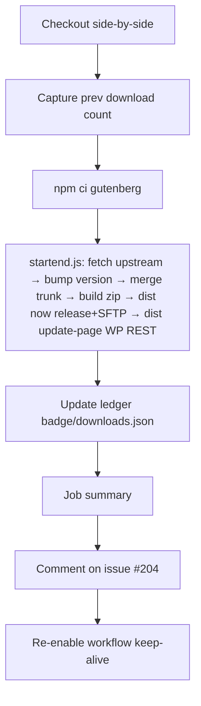

# Nightly Runbook

Day-to-day operations guide for the Distribute Gutenberg Nightly pipeline. For initial setup and history, see the other files in this folder.

## What runs

**Workflow:** [`.github/workflows/nightly.yml`](../.github/workflows/nightly.yml) — cron `0 7 * * *` (07:00 UTC / 09:00 CEST / 08:00 CET). Also `workflow_dispatch` with two modes: `full` (default) and `preflight` (creds check, no writes).

**Concurrency:** group `nightly-distribution`, `cancel-in-progress: false` — a second trigger queues rather than overlapping.

**Timeout:** 90 minutes.

## Pipeline



### Step-by-step (mapped to `nightly.yml`)

| # | Step | File / line | What it does |
|---|------|-------------|--------------|
| 1 | Checkout both repos side-by-side | `nightly.yml:70-82` | `./distribute-nightly` and `./gutenberg` (fork `bph/gutenberg`, ref `trunk`, full history) |
| 2 | Configure git identity + `upstream` remote | `nightly.yml:84-89` | Bot identity; adds `WordPress/gutenberg` as `upstream` |
| 3 | Node from Gutenberg's `.nvmrc` | `nightly.yml:92-97` | Cached npm |
| 4 | Install `distribute-nightly` deps + `dist` CLI globally | `nightly.yml:99-103` | `npm ci` + `npm install -g .` |
| 5 | Preflight (creds only) — `mode=preflight` | `nightly.yml:106-109` | `dist test --no-clear`, exits |
| 6 | Capture previous download count | `nightly.yml:114-121` | `PREV_DOWNLOADS`, `PREV_TAG` — read *before* asset gets clobbered |
| 7 | `npm ci` in gutenberg | `nightly.yml:123-126` | Build deps |
| 8 | `node startend.js` | `nightly.yml:128-131` | Version bump → merge upstream → build zip → `dist now` (release + SFTP) → `dist update-page` (WP REST). See [`startend.js`](../startend.js) |
| 9 | Update download ledger | `nightly.yml:139-161` | Adds `PREV_DOWNLOADS` to `badge/downloads.json`, appends `badge/history.csv`, commits and pushes |
| 10 | Job summary | `nightly.yml:164-179` | Version, zip size, release tag, download-page link |
| 11 | Comment on build-log issue | `nightly.yml:182-194` | ✅/❌ on [bph/gutenberg#204](https://github.com/bph/gutenberg/issues/204) |
| 12 | Keep-alive | `nightly.yml:202-206` | Re-enables the schedule (defeats 60-day auto-disable) |

## Where things live

| Thing | Location |
|-------|----------|
| Workflow file | [`.github/workflows/nightly.yml`](../.github/workflows/nightly.yml) |
| Orchestrator | [`startend.js`](../startend.js) |
| `dist` CLI | [`utils/cli.js`](../utils/cli.js) (subcommands in `utils/*.js`) |
| Fork receiving builds | [`bph/gutenberg`](https://github.com/bph/gutenberg) (branch `trunk`, tags `<major>.<minor>-nightly`) |
| Release asset | `gutenberg.zip` on the latest release of `bph/gutenberg` |
| SFTP target | `gutenbergtimes.com` (creds in secrets `FTPHOST`/`FTPPORT`/`FTPUSER`/`FTPPASS`) |
| Download page | https://gutenbergtimes.com/need-a-zip-from-master — updated via WP REST (`WP_API_URL`) |
| Build log | [bph/gutenberg#204](https://github.com/bph/gutenberg/issues/204) (env `NIGHTLY_ISSUE=204`) |
| Downloads badge | [`badge/downloads.json`](../badge/downloads.json) → shields.io endpoint |
| Download history | [`badge/history.csv`](../badge/history.csv) |
| Manual reset | [`.github/workflows/reset-fork.yml`](../.github/workflows/reset-fork.yml) |

## Secrets (repo settings → Actions secrets)

| Secret | Used by |
|--------|---------|
| `NIGHTLY_PAT` | Fine-grained PAT scoped to `bph/gutenberg` — Contents + Issues R/W. Exposed as `GITHUB_TOKEN` inside the job |
| `FTPHOST`, `FTPPORT`, `FTPUSER`, `FTPPASS` | `dist now` SFTP upload |
| `WP_API_URL`, `WP_USER`, `WP_APP_PASSWORD` | `dist update-page` (WordPress application password) |

Verify with `mode=preflight` after rotating any of these.

## Troubleshooting

### 1. Scheduled run hasn't fired yet

**First check:** [githubstatus.com](https://www.githubstatus.com/) — if the **Actions** component is red or yellow, it's platform-side. Wait it out; the concurrency guard will handle a late catch-up. Otherwise treat it as a cron delay (see below).

**Symptom:** run's "created at" is well after 07:00 UTC, or no run for today at all.

**Cause:** GitHub Actions cron is best-effort — during shared-runner high-load windows, scheduled dispatches queue up or drop. Nothing in this repo can force it.

**Response:** if it hasn't fired by ~08:30 UTC and you need today's build, run manually (Actions → Distribute Gutenberg Nightly → Run workflow → `mode=full`). The concurrency guard will queue a late scheduled fire behind your manual run.

### 2. Ledger push rejected — `! [rejected] main -> main (fetch first)`

**Symptom:** everything succeeds except the final `git push` in the "Update download ledger" step. Run marked failed even though the release, SFTP, and page update all landed.

**Cause:** another commit landed on `main` between checkout and push — usually a manual run's ledger commit racing a late scheduled run.

**Response:** nothing to do. The ledger is already correct (whichever run pushed first captured yesterday's count). Ignore the failure notification for that run.

**Prevention options** (not yet applied):
- Add `git pull --rebase origin main` before `git push` in the ledger step so a late run rebases onto the earlier commit.
- Or gate ledger updates by checking whether today's date is already in `badge/history.csv`.

### 3. Merge conflict in multiple files during `git merge upstream/trunk`

**Symptom:** `startend.js` exits with "Merge conflict in unexpected files: ..." — anything beyond `gutenberg.php` is a hard stop. Conflicts in `gutenberg.php` alone auto-resolve (keeps our version-bump).

**Cause:** upstream changed files that our fork also touched (rare — usually only `gutenberg.php` diverges, and Git Updater config in the version bump).

**Response:** run [`.github/workflows/reset-fork.yml`](../.github/workflows/reset-fork.yml) (type `RESET` to confirm) — force-pushes `upstream/trunk` over the fork's `trunk`. What survives:

- **Releases, tags, and zip assets** — they live outside the branch, untouched by a branch reset.
- **Customized `gutenberg.php`** — the workflow copies the fork's file aside before the reset and re-commits it (`reset-fork.yml:56-60`). This preserves the "Gutenberg - Nightly" plugin header, Git Updater headers, and the `gu_override_dot_org` filter, so every test site auto-updating via Git Updater stays connected.

What is lost: the fork's branch history (daily version-stamp and merge commits). That's fine — the next nightly re-stamps and continues normally.

Then re-run the nightly (`mode=full`). **Sanity check after the reset:** open `gutenberg.php` on `bph/gutenberg@trunk` and confirm the `Plugin Name`, Git Updater `GitHub Plugin URI`, and `gu_override_dot_org` filter are all present. If any are missing, restore them manually before the next nightly runs.

### 4. Preflight failure (creds)

**Symptom:** `dist test` fails.

**Response:** the failing check names the secret. Rotate → update in Settings → re-run `mode=preflight`.
- `NIGHTLY_PAT` expired → regenerate fine-grained PAT for `bph/gutenberg` (Contents + Issues + **Workflows** R/W)
- WP application password revoked → regenerate at wp-admin → Users → Profile
- SFTP auth changed → refresh the four `FTP*` secrets

### 5. Build fails at `NO_CHECKS=true npm run build:plugin-zip`

**Symptom:** zip step exits non-zero in the `node startend.js` step.

**Cause:** upstream Gutenberg broke on trunk (broken build in main, changed toolchain, new required Node version).

**Response:**
- Check the run log for the actual npm error.
- If it's a Node version mismatch, upstream bumped `.nvmrc` — the workflow auto-picks it up; re-run.
- If upstream is genuinely broken, wait for their fix and re-run manually. No action on our side.

### 6. `dist update-page` fails (WP REST)

**Symptom:** all prior steps succeed; page update fails. Release + SFTP are already done.

**Response:** re-run just the page update locally: `dist update-page` with `.env`. The zip on the release + SFTP is correct; only the download page didn't refresh.

### 7. Workflow auto-disabled after 60 days

**Symptom:** no runs firing at all. Actions tab shows the workflow greyed out.

**Cause:** the keep-alive step (`nightly.yml:202-206`) didn't run — usually because the workflow was already disabled before it could re-enable itself (e.g. it hit a long failure streak).

**Response:** Actions → workflow → "…" → Enable workflow. Trigger a manual `full` run to reset the activity clock.

### 8. Downloads cratered (100+/day → single digits) but runs still ✅

**Symptom:** the ✅ comment on [#204](https://github.com/bph/gutenberg/issues/204) reports 1–2 downloads for several days in a row after weeks of ~100+. The workflow is green, the release asset updates daily, the download page link works.

**Cause:** `bph/gutenberg@trunk` has stopped moving. Git Updater on end-user sites reads the `Version:` header from `gutenberg.php` on the fork's `trunk` to decide whether to offer an update. If `trunk` is frozen at an older version, once every site's Git Updater cache expires they all conclude they're up to date → downloads collapse.

**How to confirm quickly:**
```bash
gh api repos/bph/gutenberg/commits/trunk --jq '{sha: .sha[0:7], date: .commit.author.date}'
gh api repos/bph/gutenberg/contents/gutenberg.php --jq '.content' | base64 -d | grep '^ \* Version:'
```
If the commit date is more than ~2 days old, or the Version doesn't match today's dateStamp (`23.7.YYYYMMDD`), the push is failing.

**Most common cause:** `NIGHTLY_PAT` is missing the **Workflows** permission. Upstream Gutenberg includes files under `.github/workflows/` — when the daily merge pulls in changes to any of them, `git push origin trunk` is rejected:
```
! [remote rejected] trunk -> trunk
  (refusing to allow a Personal Access Token to create or update workflow
   `.github/workflows/build-plugin-zip.yml` without `workflow` scope)
```
Historically this failure was swallowed by `utils/git.js` (fixed 2026-07-28 — now exits the run non-zero). Older frozen-trunk periods will show green runs with this rejection buried in the "Run startend.js" step's log.

**Fix:**
1. Rotate `NIGHTLY_PAT` — add **Workflows: Read and write** to Contents + Issues. See [Preflight failure](#4-preflight-failure-creds) for the update-secret path.
2. Trigger `mode=full` — the accumulated version bumps + upstream merges push in one go.
3. Verify `gh api repos/bph/gutenberg/commits/trunk` now shows today's `prep build <MM/DD>` commit.
4. End-user sites will start seeing updates as their Git Updater caches refresh (default ~12h). Users can force via *Git Updater → Settings → Refresh Cache*. Expect the next day's ✅ comment to report a large catch-up download count.

### 9. Downloads badge shows stale total

**Symptom:** shields.io badge doesn't reflect today's cumulative count.

**Cause:** either the ledger step didn't run (see #2) or shields.io cached the old JSON.

**Response:** open [`badge/downloads.json`](../badge/downloads.json) — if `total` is correct there, shields.io will refresh on its own (5–10 min). If it's stale in the file, the ledger push failed; see #2.

## Manual operations

**Run the nightly right now:**
```
Actions → Distribute Gutenberg Nightly → Run workflow → mode=full
```

**Verify credentials without writing anything:**
```
Actions → Distribute Gutenberg Nightly → Run workflow → mode=preflight
```

**Reset the fork after a bad merge:**
```
Actions → Reset Fork → Run workflow
```

**Run locally** (side-by-side layout required — `../gutenberg` next to `../distribute-nightly`, with `.env` populated):
```bash
npm install -g .
dist test            # preflight
node startend.js     # full run
```
